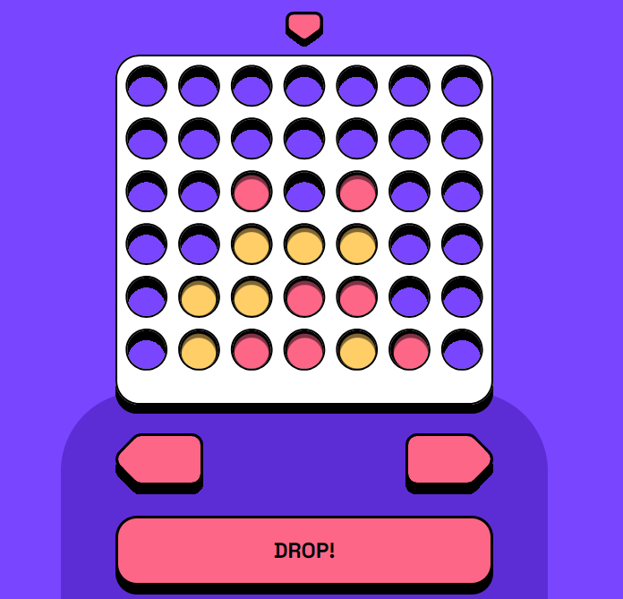

# Connect Four - vs AI & Online 2 Player

A web app implementation of the classic Connect Four game featuring a custom AI with three difficulty levels and online 2 player with a game server I wrote that can be found [here](https://github.com/JordanKisiel/connect-four-next-server).

## Table of contents

-   [Overview](#overview)
-   [Links](#links)
-   [Built with](#built-with)
-   [What I learned](#what-i-learned)
-   [Continued development](#continued-development)
-   [Author](#author)

### Links

-   Live Site URL: [https://connect-four-next-client.vercel.app/](https://connect-four-next-client.vercel.app/)
-   Detailed Breakdown: [https://jordankisiel.com/connect-four-breakdown](https://jordankisiel.com/connect-four-breakdown)

### Built with

-   Mobile-first workflow
-   [Next.js](https://nextjs.org/) - Fullstack React Framework
-   [Node](https://nodejs.org/en) - Server JavaScript Runtime
-   [Express](https://expressjs.com/) - Web Framework for Node
-   [Tailwindcss](https://tailwindcss.com/) - CSS framework
-   [GSAP](https://gsap.com/) - Animation
-   [TypeScript](https://www.typescriptlang.org/) - Language

### What I learned

This is what I would consider to be my first fullstack project as it required writing a [server](https://github.com/JordanKisiel/connect-four-next-server) to allow for online 2 player. On the client side, I learned how to take the well-known minimax algorithm ([video explanation here](https://www.youtube.com/watch?v=l-hh51ncgDI)) and add my own customizations to it for both performance and behavior when creating my custom computer player. On the server side, I learned how to set up a simple server with Node and Express and how to use the [state pattern](https://www.youtube.com/watch?v=N12L5D78MAA) to organize the code that controls the state of the game in a much easier to understand way. Finally, from the fullstack perspective, I learned how to integrate the server and client, using [Socket.io](https://socket.io/) to pass messages updating lobby, game state, and player moves.

### Continued development

At some point, I'd like to utilize websockets again to make more "multiplayer" style applications so I can learn how to tackle issues with syncing data as well learn best practices for integrating clients with servers in a more decoupled way.

## Author

-   Website - [Jordan Kisiel](https://jordankisiel.com)
-   Linkedin - [Jordan Kisiel](https://www.linkedin.com/in/jordan-kisiel-b60129114)
-   Twitter - [@JordanKisiel](https://www.twitter.com/JordanKisiel)
